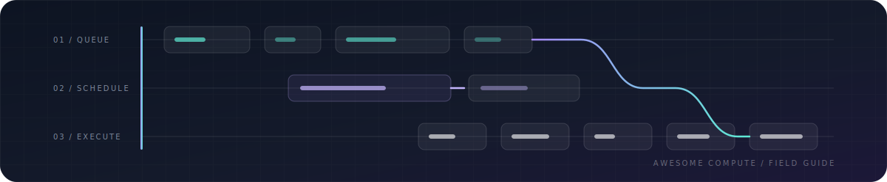

# Awesome Compute 

> A curated guide to compute orchestration, distributed execution, serverless runtimes, GPU infrastructure, workflow engines, and production observability.

Compute is not one category. A cluster scheduler, a Python task runtime, an LLM inference server, and a durable workflow engine solve different problems. This list is organized around those decisions rather than around vendor popularity.

**Editorially reviewed:** June 10, 2026 · **Entries:** 47 software projects + 20 commercial providers · **Standard:** useful, maintained, differentiated, and documented.

## Contents

- [How to Choose](#how-to-choose)
- [Compute Hardware in 60 Seconds](#compute-hardware-in-60-seconds)
- [Scope](#scope)
- [Cluster Orchestration and Scheduling](#cluster-orchestration-and-scheduling)
- [Distributed Computing](#distributed-computing)
- [Serverless and Elastic Compute](#serverless-and-elastic-compute)
- [GPU and AI Compute](#gpu-and-ai-compute)
- [Workflow Orchestration](#workflow-orchestration)
- [Container and Isolation Runtimes](#container-and-isolation-runtimes)
- [Compute Observability](#compute-observability)
- [Decentralized and Data-Local Compute](#decentralized-and-data-local-compute)
- [Commercial Compute Providers](#commercial-compute-providers)
- [Learning Resources](#learning-resources)
- [Related Awesome Lists](#related-awesome-lists)

## How to Choose

| I need to...                                           | Start with                              | Why                                                                                |
| ------------------------------------------------------ | --------------------------------------- | ---------------------------------------------------------------------------------- |
| Run long-lived containerized services                  | Kubernetes or Nomad                     | General scheduling, service discovery, rollouts, and ecosystem integrations.       |
| Schedule HPC or MPI batch jobs                         | Slurm                                   | Designed for supercomputers, queues, reservations, and tightly coupled jobs.       |
| Run many independent jobs across shared machines       | HTCondor                                | High-throughput scheduling for large numbers of loosely coupled jobs.              |
| Queue AI jobs on Kubernetes                            | Volcano or Kueue                        | Batch queues, admission control, gang scheduling, and accelerator-aware workloads. |
| Parallelize Python code                                | Ray or Dask                             | Python-native tasks, actors, arrays, dataframes, and cluster execution.            |
| Process large batch datasets                           | Apache Spark                            | Mature distributed SQL and data-processing ecosystem.                              |
| Process stateful event streams                         | Apache Flink                            | Low-latency streaming with durable state and event-time semantics.                 |
| Scale HTTP services to zero                            | Knative Serving                         | Kubernetes-native revisions, traffic splitting, and request-driven scaling.        |
| Scale workers from queues or events                    | KEDA                                    | Connects Kubernetes autoscaling to external event sources.                         |
| Serve large language models                            | vLLM or SGLang                          | High-throughput inference with batching, caching, and model-specific optimization. |
| Serve models from several frameworks                   | Triton Inference Server                 | Production model server for TensorRT, PyTorch, ONNX, Python, and more.             |
| Build scheduled data pipelines                         | Apache Airflow, Dagster, or Prefect     | DAGs, retries, state, scheduling, and operational visibility.                      |
| Run scientific pipelines across laptop, HPC, and cloud | Nextflow or Snakemake                   | Portable, reproducible research workflows.                                         |
| Make application workflows survive failures            | Temporal                                | Durable execution for long-running business and service processes.                 |
| Isolate untrusted container workloads                  | gVisor, Kata Containers, or Firecracker | Adds sandbox, VM, or microVM isolation boundaries.                                 |

## Compute Hardware in 60 Seconds

These labels describe different execution architectures. Product names are not always interchangeable, even when they accelerate similar workloads.

| Type               | What it is                                                                                                      | Start here when                                                                                                   | Main trade-off                                                                                      |
| ------------------ | --------------------------------------------------------------------------------------------------------------- | ----------------------------------------------------------------------------------------------------------------- | --------------------------------------------------------------------------------------------------- |
| CPU                | General-purpose processor optimized for flexible, branching workloads.                                          | Running operating systems, application logic, databases, preprocessing, and small or irregular models.            | Lower throughput than accelerators for large parallel tensor operations.                            |
| GPU                | Highly parallel processor with a broad software ecosystem for graphics, simulation, AI training, and inference. | You need flexible accelerated computing, especially with CUDA, ROCm, PyTorch, or JAX.                             | Memory capacity, power, interconnect, and utilization often dominate cost.                          |
| TPU                | Google's machine-learning ASIC for large matrix operations, available through Google Cloud.                     | A supported JAX or PyTorch/XLA workload maps cleanly to large, regular tensor operations.                         | XLA compilation, supported operations, shapes, and Google Cloud availability constrain portability. |
| NPU                | General term for neural-processing accelerators, commonly integrated into client, edge, and mobile systems.     | You need efficient local inference with low power use and a supported model toolchain.                            | “NPU” covers different vendor architectures with limited software portability.                      |
| LPU                | Groq's statically scheduled processor architecture designed for predictable AI inference.                       | Low-latency supported-model inference through GroqCloud or GroqRack matters more than raw hardware control.       | It is a vendor-specific inference architecture, not a general accelerator category.                 |
| Wafer-scale engine | Cerebras processor spanning most of a silicon wafer to keep compute and memory communication on one device.     | Very large model training or high-speed inference fits the Cerebras software and service model.                   | Specialized hardware, software, availability, and deployment model.                                 |
| FPGA               | Reconfigurable logic that can implement custom data paths after manufacturing.                                  | Deterministic latency, streaming pipelines, networking, or a specialized kernel justifies hardware design effort. | Development is more specialized than programming CPUs or GPUs.                                      |
| ASIC               | A chip designed for a specific workload; TPUs and many AI accelerators are ASICs.                               | Workload scale and stability justify maximum efficiency through specialized hardware.                             | High design cost and limited flexibility outside the intended workload.                             |

## Scope

Included:

- Cluster schedulers and workload managers.
- Distributed execution engines and programming models.
- Serverless, scale-to-zero, microVM, and WebAssembly compute.
- GPU operation, distributed training, and model serving.
- Workflow engines that coordinate compute.
- Container runtimes and workload isolation.
- Observability tools directly useful for operating compute.
- Selected commercial providers with a clear compute product.

Not included:

- Generic cloud service catalogs with no compute-specific guidance.
- Thin wrappers around another listed project.
- Abandoned experiments without a usable release or documentation.
- Build, packaging, and deployment tools that do not schedule or execute workloads.
- General protocol SDKs whose connection to usable compute depends on a separate application or marketplace.
- Mining-only cryptocurrency software.
- Projects included only because they have many GitHub stars.

Most software entries use an open-source license. Nomad 1.7 and later use the [Business Source License](https://github.com/hashicorp/nomad/blob/main/LICENSE), while OpenFaaS Community Edition has an [EULA that restricts commercial use](https://github.com/openfaas/faas/blob/master/EULA.md). Their entries call out those constraints explicitly.

## Cluster Orchestration and Scheduling

Tools that place workloads onto machines, manage capacity, and enforce scheduling policy.

| Project                                                | Best for                                | Why it stands out                                                                                        | Watch for                                                                                 |
| ------------------------------------------------------ | --------------------------------------- | -------------------------------------------------------------------------------------------------------- | ----------------------------------------------------------------------------------------- |
| [Kubernetes](https://github.com/kubernetes/kubernetes) | General-purpose container orchestration | Widely adopted control plane with extensive networking, storage, policy, and operations integrations.    | A large operational surface and many choices that require platform expertise.             |
| [Slurm](https://github.com/SchedMD/slurm)              | HPC and batch clusters                  | Purpose-built queues, reservations, fair-share policy, topology awareness, and MPI-oriented scheduling.  | Service-oriented and cloud-native application patterns are not its primary model.         |
| [HTCondor](https://github.com/htcondor/htcondor)       | High-throughput independent jobs        | Schedules large numbers of loosely coupled jobs across shared, heterogeneous, or opportunistic capacity. | It is optimized for throughput rather than tightly coupled low-latency parallel jobs.     |
| [Nomad](https://github.com/hashicorp/nomad)            | Simpler mixed-workload scheduling       | A single-binary scheduler for containers, VMs, Java applications, and standalone executables.            | A smaller integration ecosystem and a source-available license for newer releases.        |
| [Volcano](https://github.com/volcano-sh/volcano)       | Batch and AI jobs on Kubernetes         | Adds queues, gang scheduling, fair sharing, and batch semantics to Kubernetes.                           | It adds another scheduling layer that operators must understand and tune.                 |
| [Kueue](https://github.com/kubernetes-sigs/kueue)      | Kubernetes job queueing                 | Kubernetes-native admission control and resource sharing for batch, AI, and HPC workloads.               | It manages admission and queues rather than replacing the underlying workload controller. |

### Selection notes

- Choose Kubernetes when ecosystem breadth and platform extensibility justify a larger operational surface.
- Choose Slurm when batch throughput, reservations, MPI, and managed HPC queues are the primary concern.
- Choose HTCondor when throughput across many independent jobs matters more than tightly coupled parallel execution.
- Choose Nomad when you want a smaller control plane and need to schedule more than containers.
- Add Volcano or Kueue when Kubernetes needs explicit queues and batch admission policy.

## Distributed Computing

Programming models and engines that divide work across processes or machines.

| Project                                         | Best for                                    | Why it stands out                                                                                              | Watch for                                                                                     |
| ----------------------------------------------- | ------------------------------------------- | -------------------------------------------------------------------------------------------------------------- | --------------------------------------------------------------------------------------------- |
| [Ray](https://github.com/ray-project/ray)       | Python tasks, actors, training, and serving | Scales Python applications from local execution to clusters while supporting stateful actors and AI libraries. | Object-store pressure, dependency packaging, and cluster tuning become important at scale.    |
| [Dask](https://github.com/dask/dask)            | Parallel Python collections                 | Extends familiar NumPy, Pandas, and Python task patterns with dynamic distributed scheduling.                  | Performance depends heavily on partitioning, graph size, and data movement.                   |
| [Apache Spark](https://github.com/apache/spark) | Large-scale batch analytics                 | Mature distributed SQL, dataframe, streaming, and machine-learning ecosystem.                                  | JVM operations, shuffle cost, and cluster overhead can be excessive for smaller workloads.    |
| [Apache Flink](https://github.com/apache/flink) | Stateful stream processing                  | Strong event-time, checkpointing, and state semantics for continuous data applications.                        | Stateful streaming operations require careful checkpoint, upgrade, and backpressure planning. |
| [Apache Beam](https://github.com/apache/beam)   | Portable batch and streaming pipelines      | One programming model that can run on Flink, Spark, Google Cloud Dataflow, and other runners.                  | Runner portability is not perfect; behavior and supported features can differ.                |
| [mpi4py](https://github.com/mpi4py/mpi4py)      | MPI from Python                             | Python bindings for tightly coupled scientific and HPC programs using the Message Passing Interface.           | MPI assumes explicit communication and is a poor fit for elastic or failure-prone clusters.   |

### Ray vs. Dask vs. Spark vs. Flink

| Choose       | Programming model                                                                 | Strongest fit                                                                                       | Operational character                                                                                          | Avoid when                                                                                           |
| ------------ | --------------------------------------------------------------------------------- | --------------------------------------------------------------------------------------------------- | -------------------------------------------------------------------------------------------------------------- | ---------------------------------------------------------------------------------------------------- |
| Ray          | Python tasks, stateful actors, and distributed objects                            | AI applications that combine preprocessing, training, tuning, reinforcement learning, or serving    | Flexible application runtime with a head node, workers, object store, and optional AI libraries                | The workload is primarily SQL or dataframe ETL and a mature data platform already exists.            |
| Dask         | Dynamic Python task graphs plus parallel NumPy, Pandas, and Xarray collections    | Scaling an existing Python analytics or scientific workflow with minimal conceptual change          | Lightweight scheduler and workers that can run locally, on HPC, Kubernetes, or cloud infrastructure            | The application needs durable actors, a large SQL ecosystem, or strict stateful-streaming semantics. |
| Apache Spark | Dataframes, SQL, resilient distributed datasets, and structured streaming         | Large-scale ETL, lakehouse processing, batch analytics, and teams with JVM data-platform operations | Mature engine with substantial ecosystem, cluster integrations, query optimization, and shuffle infrastructure | The workload is fine-grained Python application logic or latency-sensitive actor communication.      |
| Apache Flink | Stateful dataflow with event time, windows, checkpoints, and continuous operators | Long-running event processing that needs durable state and low-latency streaming semantics          | Streaming-first distributed engine with explicit state backends, checkpoints, and operational lifecycle        | The workload is a Python-first task application or ordinary periodic batch pipeline.                 |

**Practical default:** start with Dask for familiar Python collections, Ray for distributed application logic and AI systems, Spark for a data platform centered on SQL and ETL, and Flink for continuously running stateful streams.

## Serverless and Elastic Compute

Platforms and runtimes for event-driven execution, scale-to-zero services, and lightweight isolation.

| Project                                                           | Best for                                           | Why it stands out                                                                                            | Watch for                                                                                             |
| ----------------------------------------------------------------- | -------------------------------------------------- | ------------------------------------------------------------------------------------------------------------ | ----------------------------------------------------------------------------------------------------- |
| [Knative Serving](https://github.com/knative/serving)             | Kubernetes-native serverless HTTP                  | Request-driven autoscaling, revisions, traffic splitting, and scale-to-zero on Kubernetes.                   | Kubernetes and networking complexity remain beneath the serverless interface.                         |
| [OpenFaaS](https://github.com/openfaas/faas)                      | Packaged functions and microservices on Kubernetes | Provides a CLI, language templates, OCI images, autoscaling, metrics, and event integrations.                | Community Edition restricts commercial use; Standard and Enterprise are separate commercial products. |
| [Apache OpenWhisk](https://github.com/apache/openwhisk)           | Event-driven function platforms                    | Distributed function execution with triggers, actions, rules, and pluggable runtimes.                        | The platform has a substantial deployment footprint and a smaller current ecosystem.                  |
| [KEDA](https://github.com/kedacore/keda)                          | Event-driven Kubernetes autoscaling                | Scales deployments and jobs from queue depth, streams, databases, and many external event sources.           | Scaling quality depends on the chosen scaler, workload controller, and queue semantics.               |
| [Firecracker](https://github.com/firecracker-microvm/firecracker) | Lightweight multi-tenant microVMs                  | Minimal virtual machine monitor designed for high-density serverless workloads with a VM isolation boundary. | It is a low-level building block, not a complete scheduling or serverless platform.                   |
| [wasmCloud](https://github.com/wasmCloud/wasmCloud)               | Distributed WebAssembly components                 | Runs portable components across clouds and edges using capability-based interfaces.                          | The component ecosystem and operational practices are less mature than containers.                    |

## GPU and AI Compute

Infrastructure for operating accelerators, training models, and serving inference.

| Project                                                                      | Best for                                | Why it stands out                                                                                                      | Watch for                                                                                |
| ---------------------------------------------------------------------------- | --------------------------------------- | ---------------------------------------------------------------------------------------------------------------------- | ---------------------------------------------------------------------------------------- |
| [vLLM](https://github.com/vllm-project/vllm)                                 | High-throughput LLM serving             | Efficient attention memory management, continuous batching, and broad model support.                                   | Supported features and peak performance vary by model architecture and hardware backend. |
| [SGLang](https://github.com/sgl-project/sglang)                              | Optimized LLM and multimodal serving    | Combines a high-performance runtime with cache-aware scheduling, structured generation, and broad accelerator support. | Its fast release cadence and model-specific paths require careful compatibility testing. |
| [Triton Inference Server](https://github.com/triton-inference-server/server) | Multi-framework production inference    | Serves TensorRT, PyTorch, ONNX, Python, and ensemble pipelines with dynamic batching.                                  | Configuration, model repositories, and backend tuning add operational complexity.        |
| [KServe](https://github.com/kserve/kserve)                                   | Model inference on Kubernetes           | Standardized predictors, autoscaling, canaries, transformers, and explainers.                                          | It inherits Kubernetes, ingress, storage, and autoscaling complexity.                    |
| [llm-d](https://github.com/llm-d/llm-d)                                      | Distributed LLM inference on Kubernetes | Adds cache-aware routing, disaggregated serving, autoscaling, and cluster-level orchestration above model servers.     | It is a young, multi-component platform intended for advanced Kubernetes deployments.    |
| [BentoML](https://github.com/bentoml/BentoML)                                | Packaging AI services                   | Python framework for turning models into deployable APIs and scalable inference services.                              | Its abstractions and deployment tooling become part of the application architecture.     |
| [NVIDIA GPU Operator](https://github.com/NVIDIA/gpu-operator)                | Operating GPUs on Kubernetes            | Automates drivers, device plugins, container runtimes, node labeling, and monitoring.                                  | Driver, kernel, Kubernetes, and GPU generation compatibility must be managed carefully.  |
| [DeepSpeed](https://github.com/deepspeedai/DeepSpeed)                        | Large-model distributed training        | Memory, communication, and parallelism optimizations for training and inference at scale.                              | Configuration is workload-specific and debugging distributed failures can be difficult.  |
| [Megatron Core](https://github.com/NVIDIA/Megatron-LM)                       | Training transformer models at scale    | Provides tensor, pipeline, data, context, and expert parallelism building blocks optimized for NVIDIA systems.         | It is specialized, configuration-heavy, and closely tied to NVIDIA's training stack.     |

### AI Compute Stack Boundaries

| Need                                                           | Start with              |
| -------------------------------------------------------------- | ----------------------- |
| General high-throughput autoregressive LLM serving             | vLLM                    |
| Optimized LLM, multimodal, or structured-generation serving    | SGLang                  |
| Several model frameworks behind one production server          | Triton Inference Server |
| Kubernetes-native inference resources and rollout policy       | KServe                  |
| Cluster-level routing and distributed LLM serving              | llm-d                   |
| Python-first packaging from model code to an API               | BentoML                 |
| Automated GPU drivers and plugins across Kubernetes nodes      | NVIDIA GPU Operator     |
| Memory and communication optimization for distributed training | DeepSpeed               |
| Transformer parallelism building blocks on NVIDIA systems      | Megatron Core           |

## Workflow Orchestration

Systems that coordinate tasks, retries, schedules, dependencies, artifacts, and long-running state.

| Project                                                      | Best for                              | Why it stands out                                                                                 | Watch for                                                                              |
| ------------------------------------------------------------ | ------------------------------------- | ------------------------------------------------------------------------------------------------- | -------------------------------------------------------------------------------------- |
| [Apache Airflow](https://github.com/apache/airflow)          | Scheduled data workflows              | Large provider ecosystem and a familiar Python DAG model for data platforms.                      | Scheduler and metadata-database operations grow complex at high DAG and task volume.   |
| [Prefect](https://github.com/PrefectHQ/prefect)              | Dynamic Python workflows              | Flexible state, retries, deployments, and observability without requiring rigid static DAGs.      | Product and deployment patterns have changed significantly across major versions.      |
| [Dagster](https://github.com/dagster-io/dagster)             | Data assets and lineage               | Software-defined assets, testing, partitioning, lineage, and data-quality-oriented orchestration. | Its asset-oriented model requires a deliberate shift from task-centric pipelines.      |
| [Argo Workflows](https://github.com/argoproj/argo-workflows) | Container-native Kubernetes pipelines | Runs DAG and step workflows where each task is a Kubernetes pod.                                  | Pod-per-step overhead and Kubernetes debugging can be costly for fine-grained tasks.   |
| [Nextflow](https://github.com/nextflow-io/nextflow)          | Portable scientific pipelines         | Reproducible pipelines across local machines, HPC schedulers, Kubernetes, and cloud.              | Its DSL and dataflow model are specialized and take time to learn well.                |
| [Snakemake](https://github.com/snakemake/snakemake)          | Readable research workflows           | Make-inspired Python workflow definitions popular in bioinformatics and computational science.    | Large deployments need disciplined profiles, environments, and executor configuration. |
| [Temporal](https://github.com/temporalio/temporal)           | Durable application workflows         | Persists workflow execution so long-running service processes survive crashes and retries.        | Workflow determinism and event-history constraints shape application design.           |

### Workflow engine boundaries

- Airflow, Prefect, Dagster, Argo, Nextflow, and Snakemake coordinate compute; they are not general cluster schedulers.
- Temporal is primarily for durable application logic, not for replacing a data warehouse or HPC queue.
- Use the scheduler appropriate to the workload underneath the workflow engine.

## Container and Isolation Runtimes

Low-level execution and workload-isolation components.

| Project                                                               | Best for                       | Why it stands out                                                                                       | Watch for                                                                                 |
| --------------------------------------------------------------------- | ------------------------------ | ------------------------------------------------------------------------------------------------------- | ----------------------------------------------------------------------------------------- |
| [containerd](https://github.com/containerd/containerd)                | Core container lifecycle       | CNCF runtime for image transfer, execution, storage, and supervision used by major container platforms. | It is infrastructure plumbing and normally needs higher-level orchestration and tooling.  |
| [CRI-O](https://github.com/cri-o/cri-o)                               | Kubernetes-focused OCI runtime | Lean implementation of the Kubernetes Container Runtime Interface.                                      | Its deliberately narrow Kubernetes focus makes it less suitable as a general runtime API. |
| [gVisor](https://github.com/google/gvisor)                            | Sandboxed containers           | Application kernel that intercepts system calls and reduces direct host-kernel exposure.                | System-call compatibility and performance differ from native Linux containers.            |
| [Kata Containers](https://github.com/kata-containers/kata-containers) | VM-isolated containers         | Container workflows backed by hardware virtualization for a stronger isolation boundary.                | VM startup, memory overhead, and hardware virtualization requirements remain.             |

## Compute Observability

Tools for measuring utilization, health, latency, failures, and resource cost.

| Project                                                                              | Best for                           | Why it stands out                                                                             | Watch for                                                                                     |
| ------------------------------------------------------------------------------------ | ---------------------------------- | --------------------------------------------------------------------------------------------- | --------------------------------------------------------------------------------------------- |
| [Prometheus](https://github.com/prometheus/prometheus)                               | Metrics and alerting               | Widely used pull-based monitoring system with service discovery, recording rules, and alerts. | High cardinality and long retention usually require careful design or additional systems.     |
| [Grafana](https://github.com/grafana/grafana)                                        | Operational dashboards             | Visualization and exploration across metrics, logs, traces, profiles, and many data sources.  | Dashboard sprawl and inconsistent metric semantics can undermine usefulness.                  |
| [OpenTelemetry Collector](https://github.com/open-telemetry/opentelemetry-collector) | Vendor-neutral telemetry pipelines | Receives, processes, samples, and exports metrics, traces, and logs.                          | Pipeline sizing, backpressure, and configuration management are operational responsibilities. |
| [Pyroscope](https://github.com/grafana/pyroscope)                                    | Continuous profiling               | Exposes CPU and memory cost at code level across production workloads.                        | Profiling overhead, symbol quality, and retention should be validated for each runtime.       |

## Decentralized and Data-Local Compute

Selected projects that schedule work across independently operated capacity or move execution closer to data.

| Project                                                     | Best for                                       | Why it stands out                                                                                      | Watch for                                                                                     |
| ----------------------------------------------------------- | ---------------------------------------------- | ------------------------------------------------------------------------------------------------------ | --------------------------------------------------------------------------------------------- |
| [Akash Provider](https://github.com/akash-network/provider) | Operating capacity on Akash                    | Provider services for offering container compute through a decentralized marketplace.                  | Marketplace demand, payment mechanics, networking, and trust differ from conventional clouds. |
| [Bacalhau](https://github.com/bacalhau-project/bacalhau)    | Compute over distributed data                  | Executes jobs where data lives across distributed, edge, and content-addressed environments.           | Data availability, network topology, and executor trust constrain suitable workloads.         |
| [Golem Yagna](https://github.com/golemfactory/yagna)        | Buying and selling general compute             | Implements Golem's node, marketplace, payment, and execution protocols for requestors and providers.   | Runtime support, payment mechanics, and workload verification differ from a managed cloud.    |
| [BOINC](https://github.com/BOINC/boinc)                     | Volunteer high-throughput scientific computing | Mature middleware for distributing independently divisible research tasks across donated machines.     | Workloads must tolerate untrusted, heterogeneous, intermittently connected hosts.             |
| [Hivemind](https://github.com/learning-at-home/hivemind)    | Peer-to-peer deep-learning training            | Coordinates training across unreliable and heterogeneous participants without a fixed central cluster. | Security assumptions, network variability, and research-oriented operations require care.     |

These systems have different trust, availability, networking, and payment models from a conventional cloud. Treat those differences as architecture inputs, not as implementation details.

## Commercial Compute Providers

Commercial services are listed separately because their evidence and selection criteria differ from open-source software.

### Hyperscale Cloud

| Provider                                                                  | Best for                                                                          | Main caveat                                                                             |
| ------------------------------------------------------------------------- | --------------------------------------------------------------------------------- | --------------------------------------------------------------------------------------- |
| [Amazon Web Services](https://aws.amazon.com/compute/)                    | Broad compute catalog, regional coverage, and enterprise integrations             | Complex pricing, quotas, and egress.                                                    |
| [Google Cloud](https://cloud.google.com/products/compute)                 | Data, Kubernetes, AI accelerators, and high-performance networking                | Product and quota availability varies by region.                                        |
| [Microsoft Azure](https://azure.microsoft.com/products/category/compute/) | Microsoft-centric enterprises, hybrid infrastructure, and procurement             | Service naming and operational complexity.                                              |
| [Alibaba Cloud](https://www.alibabacloud.com/en/product/ecs)              | Workloads serving China and the wider Asia-Pacific region                         | International and mainland China accounts, compliance, and service availability differ. |
| [Oracle Cloud Infrastructure](https://www.oracle.com/cloud/compute/)      | Oracle estates, bare metal, high-performance networking, and enterprise workloads | A smaller ecosystem and regional footprint than the three largest providers.            |

### GPU Cloud

| Provider                                          | Best for                                                                      | Main caveat                                                                                        |
| ------------------------------------------------- | ----------------------------------------------------------------------------- | -------------------------------------------------------------------------------------------------- |
| [CoreWeave](https://www.coreweave.com/)           | Large AI clusters and accelerator-focused infrastructure                      | Capacity and commitment terms matter.                                                              |
| [Lambda](https://www.lambda.ai/)                  | Straightforward GPU instances and AI clusters                                 | Smaller service catalog than hyperscalers.                                                         |
| [Runpod](https://www.runpod.io/)                  | Self-service GPU pods and serverless GPU endpoints                            | Host, storage, and networking characteristics vary by product.                                     |
| [Crusoe](https://www.crusoe.ai/)                  | Large-scale AI infrastructure and energy-aware deployments                    | Primarily oriented toward larger customers.                                                        |
| [Vast.ai](https://vast.ai/)                       | Price-sensitive access to marketplace GPU capacity                            | Hardware quality, uptime, and networking vary by host.                                             |
| [Prime Intellect](https://www.primeintellect.ai/) | GPU pods, sandboxes, hosted training, and reinforcement-learning environments | The open repository is a CLI and SDK for a managed platform, not a decentralized training runtime. |

### Serverless AI Compute

| Provider                                                | Best for                                          | Main caveat                                                                          |
| ------------------------------------------------------- | ------------------------------------------------- | ------------------------------------------------------------------------------------ |
| [Modal](https://modal.com/)                             | Python-defined serverless CPU and GPU workloads   | Application architecture becomes provider-specific.                                  |
| [Baseten](https://www.baseten.co/)                      | Managed production model serving                  | Managed convenience costs more than operating the full stack yourself.               |
| [Replicate](https://replicate.com/)                     | Calling packaged models through a simple API      | Less infrastructure control and potentially higher unit cost.                        |
| [Beam](https://www.beam.cloud/)                         | Python-first serverless GPU applications          | Smaller ecosystem and service surface.                                               |
| [Cerebras Inference](https://www.cerebras.ai/inference) | Hosted inference on Cerebras wafer-scale hardware | A specialized model API rather than general-purpose GPU or VM access.                |
| [GroqCloud](https://groq.com/groqcloud)                 | Low-latency inference on Groq LPU hardware        | A supported-model inference platform rather than general-purpose accelerator rental. |

### Edge Compute

| Provider                                                       | Best for                                        | Main caveat                                                      |
| -------------------------------------------------------------- | ----------------------------------------------- | ---------------------------------------------------------------- |
| [Cloudflare Workers](https://workers.cloudflare.com/)          | Globally distributed request and event handling | Runtime, duration, and platform limits.                          |
| [Fastly Compute](https://www.fastly.com/products/edge-compute) | Low-latency WebAssembly services at the edge    | Requires designing around the edge execution model.              |
| [Vercel Functions](https://vercel.com/docs/functions)          | Web applications already deployed on Vercel     | Best fit is application backends, not arbitrary cluster compute. |

Meta and xAI operate hyperscale AI infrastructure, but they are not listed as compute providers because they do not offer general-purpose public infrastructure. Their open-source projects or model APIs can qualify in the relevant categories.

## Learning Resources

### Distributed Systems

- [Designing Data-Intensive Applications](https://dataintensive.net/) - Foundations for storage, replication, partitioning, streams, and distributed tradeoffs.
- [Distributed Systems, 4th edition](https://www.distributed-systems.net/index.php/books/ds4/) - Open textbook by Maarten van Steen and Andrew S. Tanenbaum.
- [MIT 6.5840: Distributed Systems](https://pdos.csail.mit.edu/6.824/) - Labs and lectures covering replication, consensus, and fault tolerance.

### Kubernetes and Scheduling

- [Kubernetes Documentation](https://kubernetes.io/docs/home/) - Concepts, tasks, APIs, and operational guidance.
- [Kubernetes Scheduling Framework](https://kubernetes.io/docs/concepts/scheduling-eviction/scheduling-framework/) - Extension points and scheduling internals.
- [Slurm Documentation](https://slurm.schedmd.com/documentation.html) - Administration, scheduling, accounting, and workload commands.

### HPC and Parallel Computing

- [MPI Forum](https://www.mpi-forum.org/docs/) - Official Message Passing Interface standards.
- [LLNL HPC Tutorials](https://hpc-tutorials.llnl.gov/) - Practical MPI, OpenMP, POSIX threads, and parallel-computing material.
- [OpenMP](https://www.openmp.org/resources/tutorials-articles/) - Shared-memory parallel programming resources.

### Serverless and WebAssembly

- [CNCF Serverless Whitepaper](https://github.com/cncf/wg-serverless/tree/master/whitepapers/serverless-overview) - Terminology, architecture, and ecosystem overview.
- [WebAssembly Component Model](https://component-model.bytecodealliance.org/) - Portable component interfaces and composition.

### AI Compute Trends and Data

- [Epoch AI Data Insights](https://epoch.ai/data-insights) - Research snapshots on training compute, hardware, data centers, energy, costs, and inference economics.
- [Frontier Data Centers](https://epoch.ai/data/data-centers) - Open database tracking major AI data centers, construction timelines, estimated compute, power, and capital cost.
- [AI Chip Owners](https://epoch.ai/data/ai-chip-owners) - Estimates of how leading AI chips and compute capacity are distributed across companies and customer categories.
- [Global AI Computing Capacity](https://epoch.ai/data-insights/computing-capacity) - Evidence and methodology behind Epoch AI's estimate of rapid global AI capacity growth.
- [Hyperscaler Compute Ownership](https://epoch.ai/data-insights/hyperscalers-control-most-compute) - Analysis separating control of AI compute from public access to rentable infrastructure.
- [Hyperscaler Capital Expenditure](https://epoch.ai/data-insights/hyperscaler-capex-trend) - Tracks the recent acceleration in physical infrastructure investment by major technology companies.
- [AI Data Center Cost Breakdown](https://epoch.ai/data-insights/ai-datacenter-cost-breakdown) - Estimates the major cost components of gigawatt-scale AI data centers.

## Related Awesome Lists

- [Awesome Kubernetes](https://github.com/ramitsurana/awesome-kubernetes)
- [Awesome Serverless](https://github.com/pmuens/awesome-serverless)
- [Awesome Scalability](https://github.com/binhnguyennus/awesome-scalability)
- [Awesome Distributed Systems](https://github.com/theanalyst/awesome-distributed-systems)
- [Awesome HPC](https://github.com/dstdev/awesome-hpc)
- [Awesome WebAssembly](https://github.com/mbasso/awesome-wasm)
- [Awesome MLOps](https://github.com/kelvins/awesome-mlops)
- [Awesome Observability](https://github.com/adriannovegil/awesome-observability)
- [Awesome Selfhosted](https://github.com/awesome-selfhosted/awesome-selfhosted)

## Contributing

Contributions are welcome. Read [CONTRIBUTING.md](CONTRIBUTING.md) before opening an issue or pull request.

An entry should:

- Solve a clear compute problem.
- Have usable documentation and a working release.
- Be actively maintained or uniquely valuable enough to justify an explicit aging note.
- Add a meaningful choice rather than duplicate an existing project.
- Use an official project, documentation, or repository link.
- Include a concise description that explains why someone would choose it.
